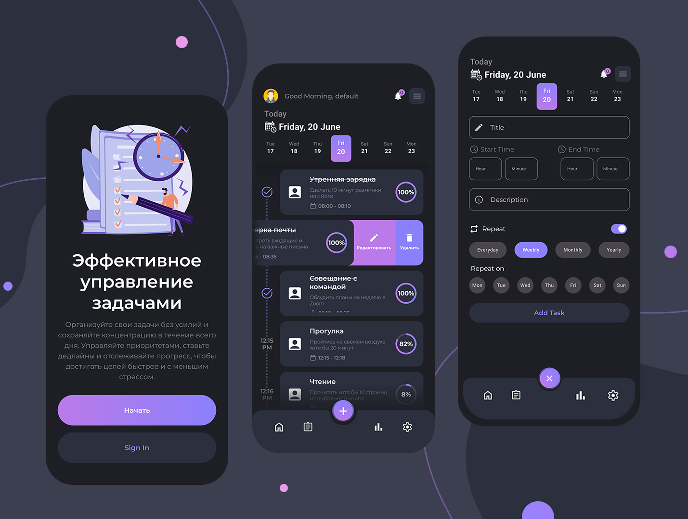

# Начни контролировать свой день с DayVee
### DayVee — это современный цифровой ежедневник, который помогает организовать время, повысить продуктивность и двигаться к целям легко и с удовольствием.
Твой персональный навигатор в мире ясного мышления и эффективного планирования.

### Возможности DayVee:
- ✅ Планирование задач на день, неделю и месяц
- ✅ Создание дел, напоминаний и быстрых заметок
- ✅ Трекер привычек и целей для постоянного прогресса
- ✅ Хранение идей и вдохновляющих мыслей в одном месте

## Скриншоты

## Технический стек:
- Kotlin
- Clean Architecture
- MVVM
- UI: Jetpack Compose
- Асинхронность: Kotlin Coroutines + Flow
- DI: Hilt
- База данных: Room
- Навигация: Navigation Component
